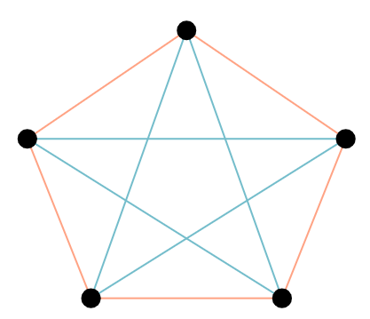

# Optimisations for generalised Time-Travel-Riddle

## Summary

I got interested in
the [time travel riddle](https://www.youtube.com/watch?v=ukUPojrPFPA&list=PLJicmE8fK0EiFRt1Hm5a_7SJFaikIFW30&index=33)
from the TED-ED channel and wondered how the problem could be generalized and solved algorithmicly. Starting from the
most naive object oriented approach optimisations are iteratively applied in order to test which decreases the running
time at most.

### The Problem

A complete undirected graph with k nodes is examined. Each edge is either blue or red, where the color is chosen
randomly. The core question in the original problem was how many nodes are necessary such that each random coloring has
a cycle of length three where all edges in this cycle have the same color (blue or red). As a demonstration, here is a
graph with five nodes without such a cycle.



#### Generalization and simplifications

As the answer to the main problem is easy to find and only relies on the size of the cycle, the obvious question is
whether and what solutions exist for longer cycles. The first approach starts with a fully connected graph and assigning
each edge a color, trying to find a cycle for either one. However, this is not necessary as the specific color is not
relevant. In the example above one could change orange and blue and there still can't be a cycle for either color. Based
on this later approaches consider only if an edge is removed or not (e.g. blue = edge exists and orange edges get
removed). This eliminates half of all graph-colorings and the above example would only be checked once for a cycle.

#### General approach

The main code can be approximately described as:

```pseudocode
start with k = 3
  create graph with k edges
  iterate over all possible graph-colorings for k nodes:
    // OO-structure / sets bits in graph matrix
    build graph for the current coloring
    search for cycle of length _c_ in colored graph
    if no cycle-found break and increase k
  if for all instances there was a cycle return k
```

#### Methods

As this was only a hobby project no strict benchmarking standards were applied, time-measurements were simply made
wih `System.currentTimeMillis`.

```java
long startTime=System.currentTimeMillis();
    var result=runExperiment(3);
    long endTime=System.currentTimeMillis();
    long time=(endTime-startTime);
```

All experiments were compiled with _OpenJDK 11_ and run on a _Ryzen 37000_ (8 cores). In order to increase comparability
most experiments were run multiple times in sequence, however due to the exponential time increase this could not be
guaranteed for all runs. The experiments were covered by the standard _Java-Flight-Recorder_ (configured by _Intellij_)
and the results analyzed as flame graphs.

## Findings

# Detailed approaches

## General properties

let _k_ be the number of vertices in _G_ and _C_ the size of the searched circle

- The fully connected graph with *k* nodes has *k* over *2*
  edges .
- Thereby there are two to the power of the size of *E* possible graphs where every edge is either *red* or *blue*

## First naive approach

- Test all possibilities
- _k * (c -1)_ worst case approximation for circle finding
- represent edges and nodes by objects
- Store the graph as set of nodes, where every node has a list of edges
- test every graph for circles with colour blue and red

| Circle Size C | Time (ms) | Iterations | Solution      | Max Size of Search tree |
|---------------|-----------|------------|---------------|-------------------------|
| 1             | -         | -          | -             | -                       |
| 2             | 0.14      | 100        | 2             | 2                       |
| 3             | 101.67    | 1 000      | 6             | 32.7685                 |
| 4             | 114.56    | 100        | 6             | 32.7685                 |
| 5             | -         | -          | Out of Memory | 268.435.456             |

## Second approach

| Circle Size C | Time (ms) | Iterations | Solution      | Max Size of Search tree |
|---------------|-----------|------------|---------------|-------------------------|
| 1             | -         | -          | -             | -                       |
| 2             | 0.014     | 1 000      | 2             | 3                       |
| 3             | 15.25     | 1 000      | 6             | 38 613                  |
| 4             | 27.82     | 100        | 6             | 40 752                  |
| 5             | -         | -          | Out of Memory | 268.435.456             |

Adding a choosing strategy to reduce the number of tried coloring-options.

| Circle Size C | Time (ms) | Iterations | Solution      | Max Size of Search tree |
|---------------|-----------|------------|---------------|-------------------------|
| 3             | 14.33     | 1 000      | 6             | 23 594                  |
| 4             | 16.589    | 1 000      | 6             | 23 719                  |
| 5             | -         | -          | Out of Memory | 268.435.456             |

## Third Approach

- Changing `SearchTree` to `EnumeratingSearch` in order to fix `OutOfMemory`-Exception.
    - All the saved `BranchOptions` with mapped and `toBeMapped` took to much space
    - This approach keeps the memory usage roughly linear in the size of _k_
        - by enumeration over all possibilities and not storing the search tree nodes.
    - Iterating over the possibilities was implemented by assigning each edge a bit (0 =red, 1=blue).
        - The complete graph was thereby encoded as a binary number which simply can be counted up.

#### Interesting finding

- As binary counting is not naturally available the binary number is stored in dec as `long`.
- Utilizing `Long.asBinaryString` the binary representation is extracted.
- However, using this approach leading zeros have to be inserted.

```java
    asBString="0".repeat(this.toBeMapped.size()-asBString.length())+asBString;
    // instead of 
    String.format(,asBString).replace(" ","0");
// brings huge performance increase (75% over all → 19% over all)
```

#### Memory allocation optimisation

- using one array for all Search-Results was 82% more efficient

| Circle Size C | Time (ms) | Iterations | Solution | Max Size of Search tree |
|---------------|-----------|------------|----------|-------------------------|
| 3             | 6.469     | 1 000      | 6        | 20 184                  |
| 4             | 12.818    | 1 000      | 6        | 21 580                  |
| 5             |           | 1          | > 8      | > 68 000 000 000        |

- Search-Space for _k=8_: 16 974 025
    - it took 20 590ms until _k=8_ was discarded (mean over 100 iterations)
- No solution up to `state = 17 677 804 469` took over 3h
- Coloring graph takes really long (38% of total computation time)

#### Cutting down the numbers

- Let _k_ be the number of nodes

- Let _v_ be the number of edges =.

- If all graphs with _k_ nodes and _x_ edges have a cycle of length _c_
    - then all graphs with _x+1_ edges have a cycle of length _c_
    - therefore for all graphs with _k - x_ >= nodes → the inverse has a cycle

- For 18,19 and 20 of 36 edges there is an instance which has no circle (of length _5_)

    - All Graphs with _9_ nodes and _21_ edges have a cycle of length _5_

      → This eliminates 56 994 458 000 possible coloring-options ($\geq 22$ edges)

## Parallel

- Partition the search space into `numOfThreads` parts.
- Each thread tests all graph encodings between its _min_ and _max_.
    - report to callback if instance without cycle was found
    - if that was the case callback will close all other threads
- This is repeated for each _k_
- **Problem**: unbalanced load → the more edges the more instances
    - the higher the number → the more edges → the more circle possibilities
    - partitions should be distributed by resulting graph instances / number of edges

| Iterations | Description            | Number of Graphs | P=1: Time (ms)  | P=16: Time      | Speedup |
|------------|------------------------|------------------|-----------------|-----------------|---------|
| 10         | c=5, k=9, step <= 10^7 | 10^7             | 14 510          | 2 671 (it =100) | 5,43    |
| 10         | step <= 10^8 * 4       | 400 000 000      | 425 344 (it =3) | 75 198          | 5,65    |

#### Improving finding cycles

- Use only *one* array for finding the cycle
    - (instead of new copied array list for every added element)
- use `inverted` parameter instead of creating an inverted new matrix

| Iterations | Description      | Number of Graphs | P=1: Time (ms)  | P=16: Time           | Speedup |
|------------|------------------|------------------|-----------------|:---------------------|---------|
| 1          | step <= 10^8 * 4 | 400 000 000      | 425 344 (it =3) | 33 681 (41391 it=10) | 5,65    |

- profiling is completely dominated by `hasNoCirlce::contains` (42%) and `colorGraph` (42%)